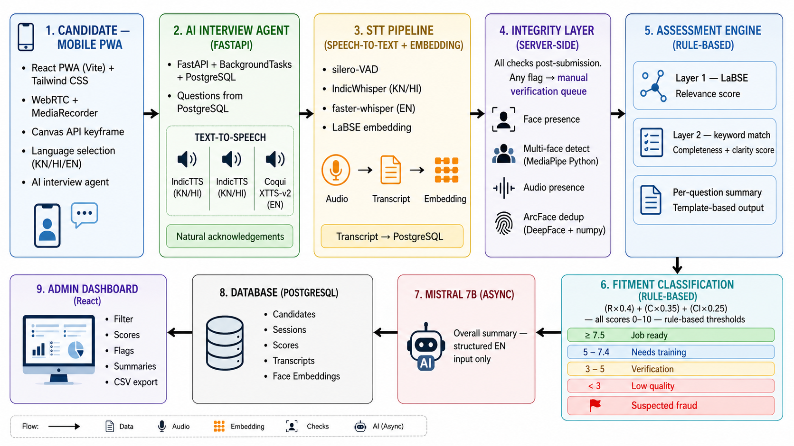

# SkillSetu

Multilingual AI-assisted workforce assessment platform for scalable, accessible, and auditable blue-collar hiring.

---

# Problem Statement

Traditional workforce screening for blue-collar and regional hiring is often inconsistent, language-restricted, and difficult to scale. Many candidates lack access to structured interview systems that support regional languages and transparent evaluation workflows.

SkillSetu aims to address this by providing a multilingual AI-assisted interview and assessment platform designed for accessible and explainable workforce screening.

---

# Overview

- Mobile-first Progressive Web App (PWA) for candidate interviews

- Multilingual voice-based interview workflow

- Structured AI-assisted candidate assessment pipeline

- Speech-to-text processing for interview transcription

- Rule-based scoring using:
  - Relevance
  - Completeness
  - Clarity

- Integrity monitoring using captured interview keyframes

- Dashboard for recruiter/admin review

- Candidate review includes:
  - Scores
  - Transcripts
  - Integrity flags
  - Recorded audio
  - Captured interview images

- Designed for explainable and auditable assessment workflows

- Supports scalable workforce screening in multilingual environments

---

# System Architecture



---

# Tech Stack

## Frontend
- React
- Vite
- Tailwind CSS

## Backend
- FastAPI
- SQLAlchemy

## Database
- PostgreSQL (Neon)

## AI / Processing
- Gemini API
- Speech-to-text processing
- Media processing pipeline

---

# Repository Structure

```text
backend/              → FastAPI backend, APIs, DB integration, media handling
dashboard/Admin/      → Admin dashboard frontend
PWA/                  → Candidate-facing interview application
stt-assessment/       → Speech-to-text and assessment utilities
```

---

# Live Deployment Links

## Dashboard
[link](https://ai-skillfit-wyaj.vercel.app/)

## Interview Page (PWA)
[link](https://ai-skillfit-xz52.vercel.app/)

## Backend API Docs
[link](https://skillsetu-backend-gau1.onrender.com/docs)

---

# Local Execution Instructions

## 1. Clone Repository

```bash
git clone <repository_url>
cd <repository_name>
```

---

## 2. Backend Setup (FastAPI)

Open terminal:

```bash
cd backend
```

### Create Virtual Environment

#### Windows

```bash
python -m venv venv
venv\Scripts\activate
```

#### Linux/macOS

```bash
python3 -m venv venv
source venv/bin/activate
```

### Install Dependencies

```bash
pip install -r requirements.txt
```

### Start Backend on Port 8000

```bash
uvicorn main:app --reload --port 8000
```

Backend runs at:

```text
http://localhost:8000
```

Swagger docs:

```text
http://localhost:8000/docs
```

---

## 3. STT Assessment Setup

Open new terminal:

```bash
cd stt-assessment
```

### Create Virtual Environment

#### Windows

```bash
python -m venv venv
venv\Scripts\activate
```

#### Linux/macOS

```bash
python3 -m venv venv
source venv/bin/activate
```

### Install Dependencies

```bash
pip install -r requirements.txt
```

### Note

Additional STT model downloads may occur automatically during first execution depending on configuration.

---

## 4. Dashboard Setup

Open new terminal:

```bash
cd dashboard/Admin
```

### Install Dependencies

```bash
npm install
```

### Run Dashboard

```bash
npm run dev
```

Dashboard runs at:

```text
http://localhost:5173
```

(or automatically shifts to 5174 if occupied)

---

## 5. PWA Setup

Open new terminal:

```bash
cd PWA
```

### Install Dependencies

```bash
npm install
```

### Run PWA

```bash
npm run dev
```

PWA runs at:

```text
http://localhost:5173
```

(or automatically shifts to 5174 if occupied)

---

# Demo Workflow

1. Open PWA  
2. Register candidate  
3. Start interview  
4. Record responses  
5. Submit interview  
6. Open dashboard  
7. Review:
   - scores
   - transcripts
   - integrity flags
   - recorded audio
   - captured images

---

# Deployment

## Backend
- Hosted on Render

## Frontend
- Hosted on Vercel

## Database
- PostgreSQL (Neon)

---

# Prototype Notes

- Mock/fallback execution modes are built into the system for easier local execution and evaluation.

- Certain infrastructure-heavy components were modularized and simplified for prototype-stage deployment and testing.

- Additional STT-related dependencies or model downloads may occur automatically depending on runtime configuration.

- Some legacy or inactive folders may exist in the repository and can be ignored safely during execution.

- Active runtime components:
  - backend/
  - stt-assessment/
  - dashboard/
  - PWA/

---

# Team

Add team member details here.
